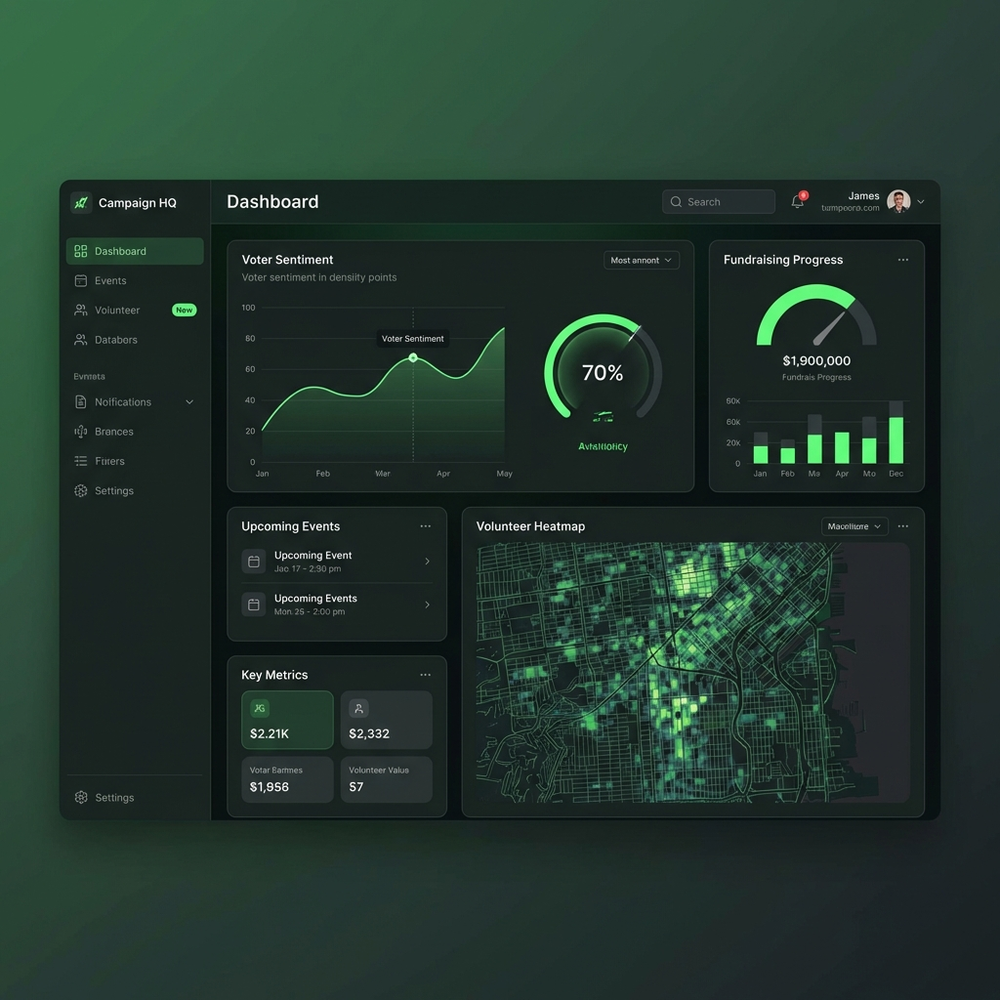
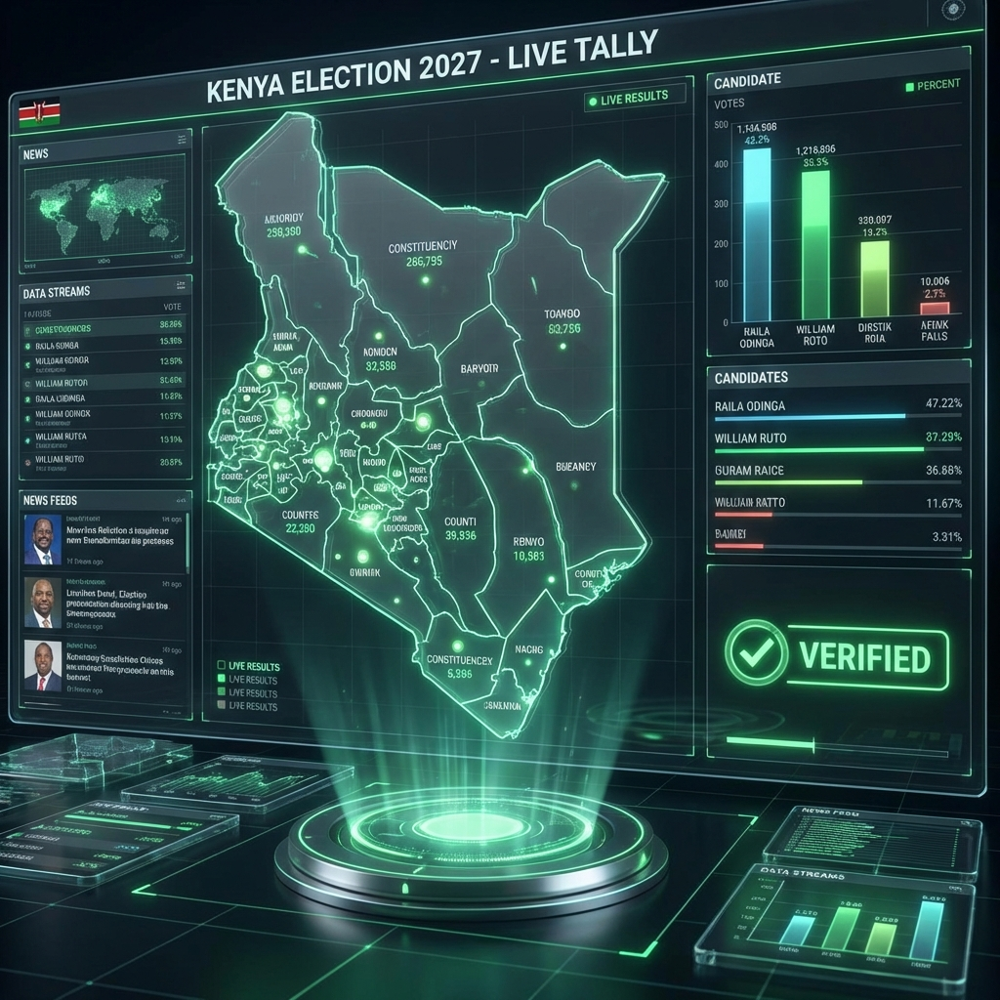

# Political Intelligence Platform

_Empowering Democracy Through Technology_

## Executive Summary

The Political Intelligence Platform is a revolutionary digital ecosystem designed to bridge the gap between citizens and their leaders. By leveraging data, transparency, and real-time engagement, we provide the tools necessary for a more accountable and participatory democracy.

## Key Features

### 1. The Baraza (Civic Feed)

A real-time, uncensored public square where citizens can discuss issues, debate policies, and interact directly with leaders.

- **Live Debates**: Host and participate in town halls.
- **Trending Topics**: AI-driven analysis of what matters most to the people.
- **Community Validation**: Fact-checking and community notes to ensure truth prevails.

### 2. Campaign HQ

For political leaders and aspiring candidates, Campaign HQ provides a suite of professional management tools.

- **Voter CRM**: Manage interactions and track support.
- **Fundraising**: Secure and transparent donation processing.
- **Volunteer Management**: Mobilize your grassroots army effectively.

### 3. The Marketplace

A dedicated economy for political action.

- **Services**: Find campaign managers, strategists, and data analysts.
- **Merchandise**: distinctive campaign gear and materials.
- **Data**: Access compliant voter insights and demographic reports.

### 4. Tallying Center & Transparency

Trust is the currency of democracy. Our independent tallying center provides:

- **Real-Time Results**: Live streams from polling stations.
- **Form 34A Verification**: Crowd-sourced verification of official documents.
- **Historical Data**: Compare current trends with past elections.

### 5. Polify AI

Our proprietary AI engine analyzes vast amounts of data to provide actionable intelligence.

- **Sentiment Analysis**: Understand the public mood in real-time.
- **Policy Impact**: Simulate the potential effects of proposed legislation.
- **Predictive Modeling**: Forecast electoral outcomes based on data.

## Join the Future

The Political Intelligence Platform is more than just software; it's a movement towards a better, more transparent Kenya.

---

_Generated by PoliFy AI_
